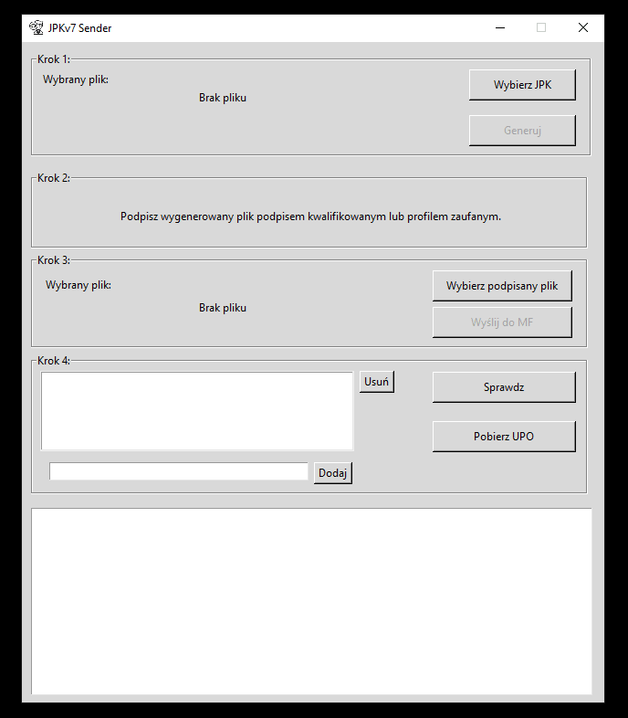
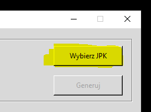
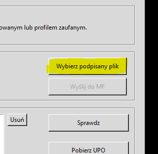
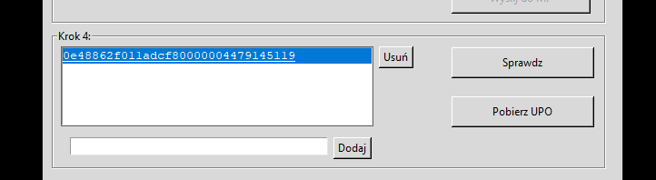
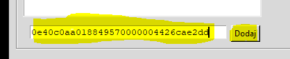
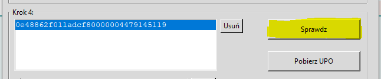

# JPKv7-Sender
It's small semi-auto app to sending JPkv7m and JPKv7k. Use only for TEST API in Ministry of Finance.
It uses tkinter and was designed using [PAGE](http://page.sourceforge.net/). It conforms to the specification of the test api [LINK](https://www.podatki.gov.pl/media/1138/specyfikacja_interfejsow_uslug_jpk_wersja_2_3.pdf)

# Run
Using pip install all dependencies from requirements.txt. Then run main.py or create single .exe file by auto-py-to-exe.

# How to use
- Run main.py
- Select generated JPK file by pressing on "Wybierz JPK':

- After file was loaded click on "Generuj" to generate "initial upload file"
- Signed file using "qualified signature" or "trusted profile"
- Select signed file by pressing on "Wybierz podpisany plik"

- Click 'Wyśli do MF' to send signed file.
- If the file is successful send, his reference number pop up in the list box

# Manually adding a reference number
- enter the reference number in the text input field and hit "Dodaj"

# Checking status of uploaded JPK files
- select reference number and press "Sprawdz"

# TODO
- downloading UPO
 